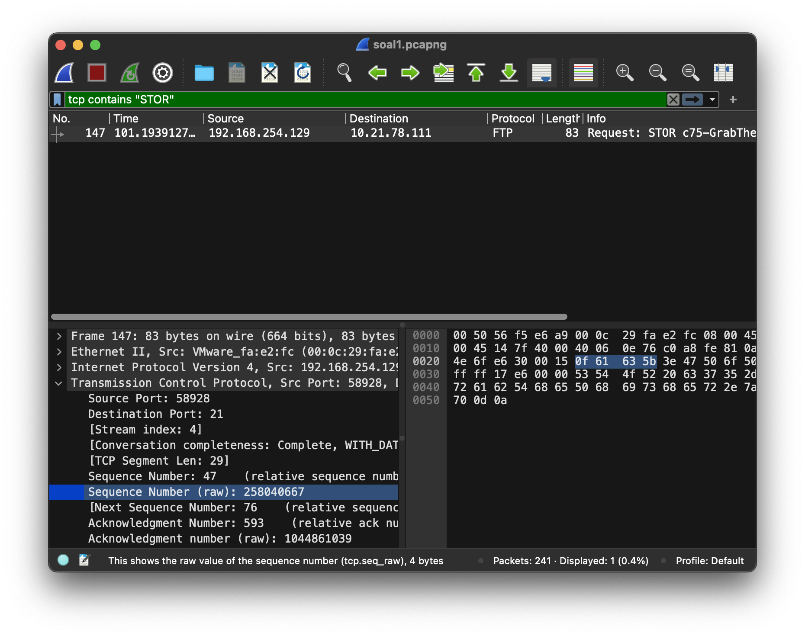

# Jarkom-Modul-1-E22-2023

| Nama                       | NRP        |
| -------------------------- | ---------- |
| Anggara Saputra            | 5025211241 |
| Faizah Nurdianti Maghfirah | 5025211134 |

## Soal 1

**User melakukan berbagai perintah dengan menggunakan protokol FTP.**

Menampilkan Sequence Number (raw) & Acknowledgment Number (raw) - Request

Menampilkan Sequence Number (raw) & Acknowledgment Number (raw) - Response

Hasil Jawaban untuk 4 pertanyaan yang ada

## Soal 2

Sebutkan web server yang digunakan pada portal praktikum Jaringan Komputer

- Display filter `http contains "server"`

Jawab: gunicorn

## Soal 3

**A. Berapa banyak paket yang tercapture dengan IP source maupun destination address adalah 239.255.255.250 dengan port 3702?** 

Ketika dilakukan filtering `ip.addr == 239.255.255.250 && udp.port == 3702` maka bisa langsung dihitung dan didapatkan hasilnya, yaitu **21**

**B. Protokol layer transport apa yang digunakan?**

Hasil filtering tadi juga akan menunjukan bahwa protokol yang digunakan adalah **UDP**

## Soal 4

Berapa nilai checksum yang didapat dari header pada paket nomor 130?
- Display filter `frame.number == 130` dan dilihat nilai checksumnya

Jawab: 0x18e5

## Soal 5

**Elshe menemukan suatu file packet capture yang menarik. Bantulah elshe untuk menganalisis file packet capture tersebut.**

Filtering dilakukan terlebih dahulu untuk mencari alamat login, agar dapat mengetahui password yang ditentukan dan akan dilakukan decode

**Berapa banyak packet yang berhasil di capture dari file pcap tersebut?**

File menunjukan **60** file pcap

**Port berapa pada server yang digunakan untuk service smtp?**

Detail menunjukan Source port adalah **25**

**Dari semua alamat ip yang tercapture, ip berapakah yang merupakan public ip?** 

IPv4 - 6 menunjukan 6 alamat ip dan hanya satu yang tidak local, yaitu **74.53.140.153**

## Soal 6

REVISI

- a1 e 5 u21 menunjukkan encoding yang digunakan yaitu a1z26 cipher
- server SOURCE ADDRESS 7812 is invalid menunjukkan nomor packet

- IP address packet 7812 yaitu 104.18.14.101 didecode

Jawab: JDRNJA

## Soal 7

**Berapa jumlah packet yang menuju IP 186.87.193.88?**

Filtering `ip.src == 184.87.193.88` menunjukan ada **6** packet

## Soal 8

**Berikan kueri filter sehingga wireshark hanya mengambil semua protokol paket yang menuju port 80! (jika terdapat lebih dari 1 port, maka urutkan sesuai dengan abjad)**

`tcp.dst.port == 80 || udp.dstport == 80`

## Soal 9

**Berikan kueri filter sehingga wireshark hanya mengambil paket yang berasal dari alamat 10.51.40.1 tetapi tidak menuju ke alamat 10.39.55.34**

`ip.src == 10.51.40.1 && ip.dst != 10.39.55.34`

## Soal 10

Sebutkan kredensial yang benar ketika user mencoba login menggunakan Telnet
- Brute force dicari dari packet dengan protocol `TELNET`

Jawab: dhafin:kesayangannyak0k0

**REVISI**

Cara supaya tidak brute force: 
- Display filter frame contains "Login"
- Follow TCP stream

## Kendala

### Soal 9

Awalnya soal 9 tidak bisa mendapatkan hasil yang *benar* meskipun sudah memasukan kueri yang sama dengan yang saat ini

### Soal 5

Kesulitan dalam melakukan decode pada beberapa website
